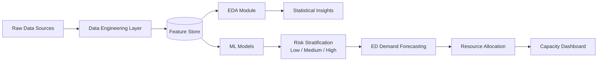

# CVD Risk Stratification & ED Capacity Planning System


An **end-to-end data-science & data-engineering platform** that ingests synthetic
clinical data (structured EHRs + unstructured clinical notes), engineers a rich
feature store, stratifies patients into **cardiovascular disease (CVD) risk tiers
(Low / Medium / High)** using machine-learning models, and translates those
risk-stratified predictions into an actionable **Emergency Department (ED)
capacity-planning** plan (demand forecasting, resource allocation, and
cost-minimising staffing optimisation).

> ⚠️ **Disclaimer** — This project uses **synthetic, non-PHI data** (UCI Heart
> Disease encoding + procedural augmentation via Faker). The Framingham-style
> risk score is a *simplified educational* implementation and is **not** a
> validated clinical instrument. Nothing here should be used for real diagnosis.

---

## Executive Summary

Cardiovascular disease is the leading global cause of death, and Emergency
Departments bear a disproportionate share of acute cardiac presentations.
Hospitals need to (a) identify which patients carry the highest CVD risk and
(b) anticipate how that risk translates into downstream ED demand so that beds,
staff, and equipment can be provisioned ahead of surges.

This repository delivers a **production-quality, modular pipeline** that answers
both questions. The **Data Engineering layer** generates and validates 10,000
synthetic patients, ~30k clinical notes, and ~15k ED visits, then assembles a
governed **feature store** (Parquet + CSV) with 30+ engineered features,
including a Framingham-inspired 10-year risk score and NLP-derived flags from
clinical narratives. The **EDA layer** produces statistical tests and 10+
publication-quality figures. The **Modeling layer** trains and compares four
classifiers (Logistic Regression, XGBoost, Gradient Boosting, Random Forest)
with cross-validation, calibration, and a model registry.

Finally, the **ED Capacity Planning module** consumes the risk predictions to
forecast 60 days of ED demand per risk group (Prophet + SARIMA ensemble),
applies risk-based resource rules with a 20% surge buffer, and solves a linear
program (PuLP/CBC) for cost-minimising staffing. The result is a full decision
pipeline from *raw clinical record* to *hospital operations dashboard*.

---

## Table of Contents

- [Architecture](#architecture)
- [Project Structure](#project-structure)
- [Installation & Setup](#installation--setup)
- [Quick Start](#quick-start)
- [Modules](#modules)
- [Key Results & Findings](#key-results--findings)
- [Methodology](#methodology)
- [Data Dictionary](#data-dictionary)
- [Configuration](#configuration)
- [Testing](#testing)
- [Contributing](#contributing)
- [License](#license)
- [Authors & Acknowledgements](#authors--acknowledgements)

---

## Architecture

```
┌──────────────────────┐     ┌───────────────────────────┐     ┌───────────────────┐
│   Raw Data Sources   │────▶│   Data Engineering Layer   │────▶│   Feature Store   │
│  (synthetic EHRs,    │     │  ingest · validate · clean │     │  features.parquet │
│   notes, ED visits)  │     │  transform · NLP · QA      │     │  ed_demand_ts.pq  │
└──────────────────────┘     └───────────────────────────┘     └─────────┬─────────┘
                                                                          │
              ┌───────────────────────────────────────────────────────────┼───────────────────────┐
              │                                                             │                       │
              ▼                                                             ▼                       ▼
    ┌───────────────────┐                                       ┌────────────────────┐   ┌────────────────────┐
    │    EDA Module     │                                       │     ML Models      │   │  ED Demand         │
    │  stats · tests ·  │                                       │  LogReg · XGBoost  │   │  Forecasting       │
    │  10+ figures      │                                       │  GBM · RandForest  │   │  (Prophet+SARIMA)  │
    └─────────┬─────────┘                                       └──────────┬─────────┘   └──────────┬─────────┘
              │                                                            │                        │
              ▼                                                            ▼                        ▼
   ┌────────────────────┐                                    ┌────────────────────────┐  ┌────────────────────┐
   │ Statistical        │                                    │  Risk Stratification   │  │ Resource Allocation│
   │ Insights (report)  │                                    │  Low / Medium / High   │─▶│  + LP Optimiser    │
   └────────────────────┘                                    └────────────────────────┘  └──────────┬─────────┘
                                                                                                     ▼
                                                                                          ┌────────────────────┐
                                                                                          │ Capacity Dashboard │
                                                                                          │  (HTML + figures)  │
                                                                                          └────────────────────┘
```



A detailed technical architecture is available in
[`docs/architecture.md`](docs/architecture.md).

---

## Project Structure

```
Data-Analytic-Data-Engineering/
├── data/
│   ├── raw/                     # Generated synthetic source data (CSV)
│   │   ├── patients.csv
│   │   ├── clinical_notes.csv
│   │   └── ed_visits.csv
│   ├── processed/               # Cleaned, validated, transformed data
│   │   ├── patients_processed.csv
│   │   ├── clinical_notes_features.csv
│   │   ├── ed_visits_processed.csv
│   │   └── quality_report.json
│   └── feature_store/           # Model-ready feature tables
│       ├── features.parquet / .csv
│       └── ed_demand_timeseries.parquet / .csv
├── src/
│   ├── data_engineering/        # Schema, synthetic generator, ETL, features, catalog
│   ├── eda/                     # Descriptive stats, statistical tests, visualisations
│   ├── modeling/                # Feature selection, training, evaluation, registry
│   ├── ed_capacity/             # Forecasting, allocation, optimisation, dashboard
│   └── utils/
├── notebooks/
│   ├── 01_data_exploration.ipynb
│   ├── 02_modeling.ipynb
│   └── 03_ed_capacity_planning.ipynb
├── models/                      # Serialised models + model_registry.json
├── outputs/
│   ├── figures/                 # 25+ PNG figures (EDA, modeling, capacity)
│   └── reports/                 # CSV/MD/JSON analytical reports
├── docs/
│   ├── architecture.md
│   ├── methodology.md
│   └── data_catalog.json
├── tests/
│   └── test_data_engineering.py # pytest unit tests
├── main.py                      # CLI entrypoint (all pipelines)
├── config.yaml                  # Central configuration
├── requirements.txt
├── pyproject.toml
├── Makefile
└── README.md
```

---

## Installation & Setup

**Prerequisites:** Python 3.10+ and `pip`.

```bash
# 1. Clone the repository
git clone https://github.com/walash/Data-Analytic-Data-Engineering.git
cd Data-Analytic-Data-Engineering

# 2. (Recommended) create and activate a virtual environment
python -m venv .venv
source .venv/bin/activate          # Windows: .venv\Scripts\activate

# 3. Install dependencies
pip install -r requirements.txt

# 4. (Optional) install the project as an editable package
pip install -e .
```

> **Note on Prophet:** `prophet` requires a C++ toolchain. If installation is
> problematic in your environment, the forecasting module automatically falls
> back to **SARIMA** (statsmodels).

---

## Quick Start

Run the entire pipeline end-to-end:

```bash
python main.py --pipeline full
```

Or run individual stages:

```bash
python main.py --pipeline data_engineering   # generate data, ETL, feature store
python main.py --pipeline eda                # statistical analysis + figures
python main.py --pipeline modeling           # train + evaluate + register models
python main.py --pipeline ed_capacity        # forecast + allocate + optimise
```

Using the **Makefile** (thin wrappers around `main.py`):

```bash
make install        # pip install -r requirements.txt
make data           # data_engineering pipeline
make eda            # EDA pipeline
make train          # modeling pipeline
make forecast       # ED capacity pipeline
make all            # full pipeline
make test           # run pytest
```

Logs stream to the console **and** to `logs/pipeline.log`. Every stage reports
its wall-clock duration.

---

## Modules

### 1. Data Engineering (`src/data_engineering/`)
- **`schema.py`** — Pydantic v2 data contracts (UCI Heart Disease encoding) for
  patients, clinical notes, ED visits, and the engineered feature vector.
- **`data_generator.py`** — Synthetic data generator (Faker) producing
  statistically plausible EHRs, free-text clinical notes, and ED visit logs.
- **`etl_pipeline.py`** — Ingestion + schema validation, missing-value handling,
  dtype enforcement, standard scaling, one-hot encoding, keyword NLP flag
  extraction, temporal ED features, and a data-quality report.
- **`feature_engineering.py`** — Framingham-inspired risk score, 10-year CVD risk
  %, comorbidity index, HR-reserve ratio, categorical bucketing, and per-patient
  ED aggregates → the feature store.
- **`data_catalog.py`** — Generates a machine-readable data catalog.

### 2. Exploratory Data Analysis (`src/eda/`)
Descriptive statistics, categorical breakdowns, hypothesis tests (chi-square,
ANOVA, t-tests, correlation), and 10+ figures (risk distribution, age×risk
heatmap, correlation heatmap, demographic breakdowns, temporal ED patterns,
Framingham distribution). Produces `outputs/reports/eda_summary_report.md`.

### 3. Predictive Modeling (`src/modeling/`)
Feature selection (mutual information + RFE + VIF), a preprocessing/training
pipeline with grid-search cross-validation, evaluation (confusion matrices, ROC,
PR, calibration, learning curves), a calibrated best-model `RiskStratifier`
inference interface, and a JSON **model registry**.

### 4. ED Capacity Planning (`src/ed_capacity/`)
60-day demand forecasting per risk group (Prophet + SARIMA ensemble), risk-based
resource allocation with a 20% surge buffer, a PuLP linear-programming staffing
optimiser, and an HTML capacity dashboard with 8 figures.

---

## Key Results & Findings

### CVD Risk Prevalence (10,000 synthetic patients)

| Risk Level | Patients | Share | Heart-Disease Prevalence |
|------------|---------:|------:|-------------------------:|
| Low        | 7,168    | 71.7% | 13.1% |
| Medium     | 1,946    | 19.5% | 44.4% |
| High       | 886      |  8.9% | 74.7% |

Disease prevalence rises monotonically across risk tiers, confirming the risk
stratification meaningfully separates the population.

### Top Predictive Features (composite MI + RFE ranking)

1. ED high-acuity visit count
2. ED total visit count
3. ED average resources used
4. Clinical-note dyspnea mention
5. ED average length of stay
6. Clinical-note chest-pain mention
7. Estimated 10-year CVD risk %
8. Framingham risk score
9. Comorbidity index
10. Average note length

### Model Performance Comparison (hold-out validation set)

| Model | Accuracy | F1 (macro) | ROC-AUC (OvR) | Train time |
|-------|---------:|-----------:|--------------:|-----------:|
| **Logistic Regression** ⭐ | **0.9953** | **0.9905** | **0.9999** | 1.2 s |
| XGBoost                    | 0.9793 | 0.9649 | 0.9979 | 32.6 s |
| Gradient Boosting          | 0.9753 | 0.9595 | 0.9981 | 226.9 s |
| Random Forest              | 0.9567 | 0.9316 | 0.9936 | 12.4 s |

⭐ **Best model:** Logistic Regression (selected on macro-F1), calibrated and
registered as the production inference model. Its strong performance reflects the
largely linear separability introduced by the engineered risk features.

### ED Capacity Insights (60-day forecast horizon)

| Metric | Value |
|--------|------:|
| Total forecasted ED visits | 775 |
| High-demand days (>85% utilisation) | 3 |
| Mean capacity utilisation | 69% |
| Peak capacity utilisation | 89% |
| Peak total beds required | 13 |
| Peak ICU beds required | 8 |
| Peak physicians required | 4 |
| Peak nurses required | 8 |
| Optimised 7-day staffing cost | $127,400 |

---

## Methodology

- **Data pipeline** — schema-validated ingestion → cleaning/imputation → dtype
  enforcement → scaling/encoding → NLP flag extraction → feature store.
- **Feature engineering** — Framingham-style point system → 10-year risk % via
  logistic transform; comorbidity index, HR-reserve ratio, categorical buckets;
  patient-level ED aggregates and daily risk-group demand series.
- **Modeling** — stratified train/val split, grid-search CV, macro-F1 model
  selection, probability calibration, model registry versioning.
- **Forecasting** — Prophet (weekly/yearly seasonality) + SARIMA
  `(1,1,1)(1,1,1)₇` combined 60/40; SARIMA fallback when Prophet is unavailable.
- **Capacity planning** — risk-based resource rules + 20% surge buffer + LP
  staffing optimisation (PuLP/CBC) over a rolling 7-day window.

Full details in [`docs/methodology.md`](docs/methodology.md).

---

## Data Dictionary

### `patients` (structured EHR — UCI Heart Disease encoding)

| Column | Type | Description |
|--------|------|-------------|
| `patient_id` | str | Unique identifier (e.g. `P0000001`) |
| `age` | int | Age in years (18–100) |
| `sex` | int | 0 = female, 1 = male |
| `chest_pain_type` | int | 0=typical, 1=atypical, 2=non-anginal, 3=asymptomatic |
| `resting_bp` | int | Resting systolic BP (mm Hg) |
| `cholesterol` | int | Serum cholesterol (mg/dl) |
| `fasting_blood_sugar` | int | 1 if fbs > 120 mg/dl else 0 |
| `rest_ecg` | int | 0=normal, 1=ST-T abnormality, 2=LV hypertrophy |
| `max_heart_rate` | int | Max heart rate achieved (thalach) |
| `exercise_angina` | int | Exercise-induced angina (0/1) |
| `st_depression` | float | ST depression (oldpeak), 0.0–7.0 |
| `st_slope` | int | 0=upsloping, 1=flat, 2=downsloping |
| `ca_vessels` | int | # major vessels coloured by fluoroscopy (0–3) |
| `thal` | int | 1=normal, 2=fixed defect, 3=reversible defect |
| `target` | int | 1 = heart disease present, 0 = absent |
| `risk_level` | str | Derived Low / Medium / High risk bucket |

### `ed_visits` (Emergency Department visit events)

| Column | Type | Description |
|--------|------|-------------|
| `visit_id` | str | Unique visit identifier |
| `patient_id` | str | FK → `patients.patient_id` |
| `visit_timestamp` | datetime | Arrival timestamp |
| `chief_complaint` | str | Presenting complaint |
| `triage_level` | int | ESI triage level 1 (most urgent) – 5 |
| `disposition` | str | discharged / admitted / icu_admit / transferred / … |
| `los_hours` | float | Length of stay in hours |
| `resources_used` | int | Count of resources consumed |

A complete machine-readable catalog lives in [`docs/data_catalog.json`](docs/data_catalog.json).

---

## Configuration

All tunable parameters (data paths, model hyperparameters, ED capacity
thresholds, forecasting horizon/seasonality) live in
[`config.yaml`](config.yaml). Edit it to change behaviour without touching code.

---

## Testing

```bash
pip install pytest
pytest -q                     # or: make test
```

The suite in `tests/test_data_engineering.py` covers schema validation, ETL
transformation steps, and feature-engineering functions (15+ tests).

---

## Contributing

1. Fork the repository and create a feature branch:
   `git checkout -b feature/my-improvement`.
2. Follow PEP 8; keep functions typed and documented.
3. Add/extend tests under `tests/` and ensure `pytest` passes.
4. Commit with clear messages and open a Pull Request against `main` describing
   the change and its rationale.

---

## License

Released under the **MIT License** — see [`LICENSE`](LICENSE) for details.

---

## Authors & Acknowledgements

- **Author:** walash
- **Data encoding:** UCI Machine Learning Repository — *Heart Disease* (Cleveland)
  dataset conventions.
- **Libraries:** pandas, NumPy, scikit-learn, XGBoost, imbalanced-learn,
  statsmodels, Prophet, PuLP, matplotlib, seaborn, Faker, Pydantic.
- Built as a comprehensive demonstration of full-stack data engineering and data
  science for healthcare operations.
