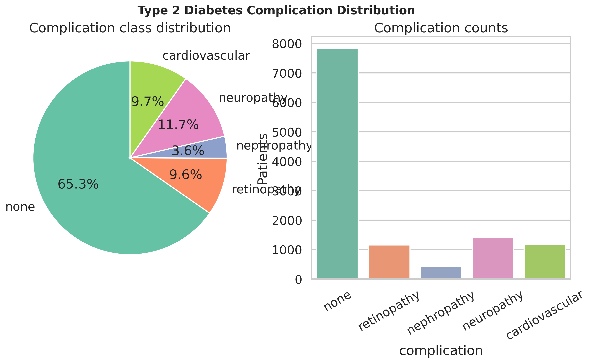
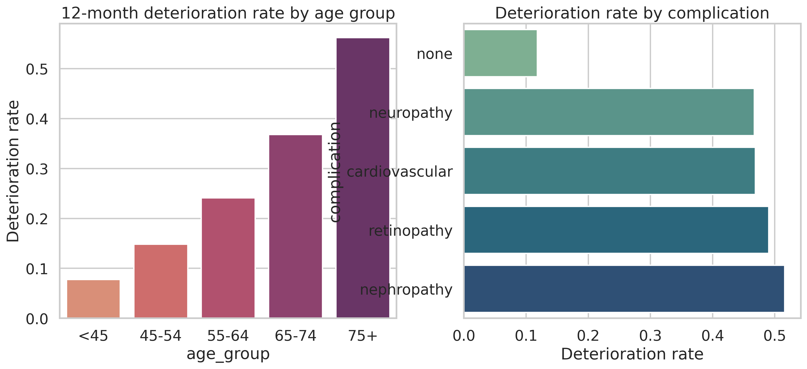
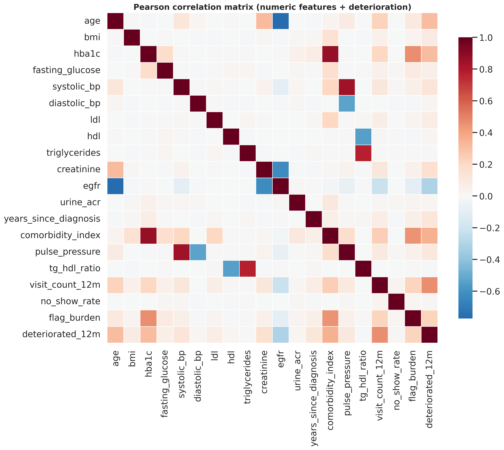
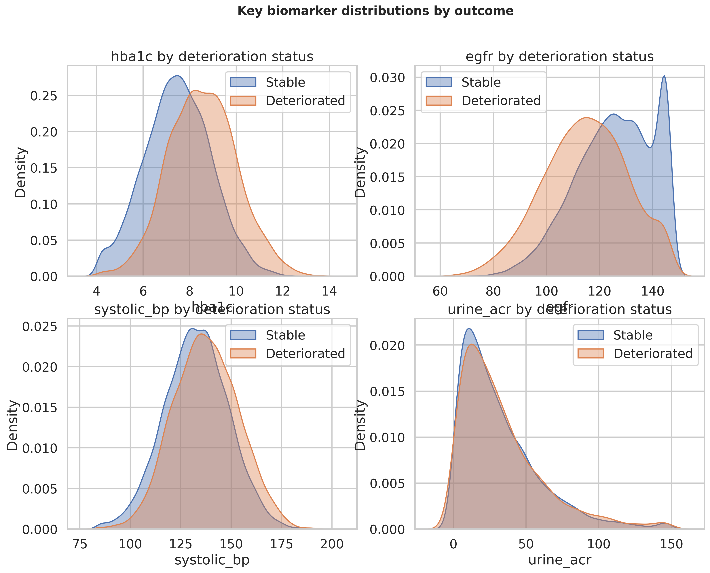
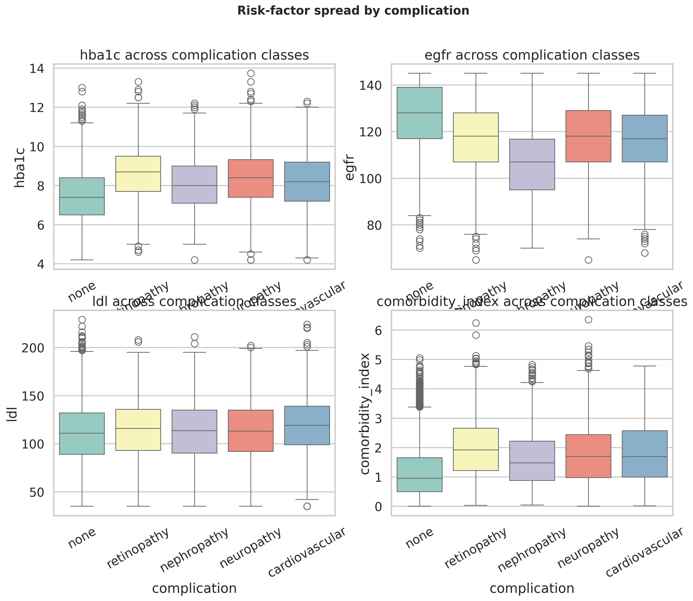
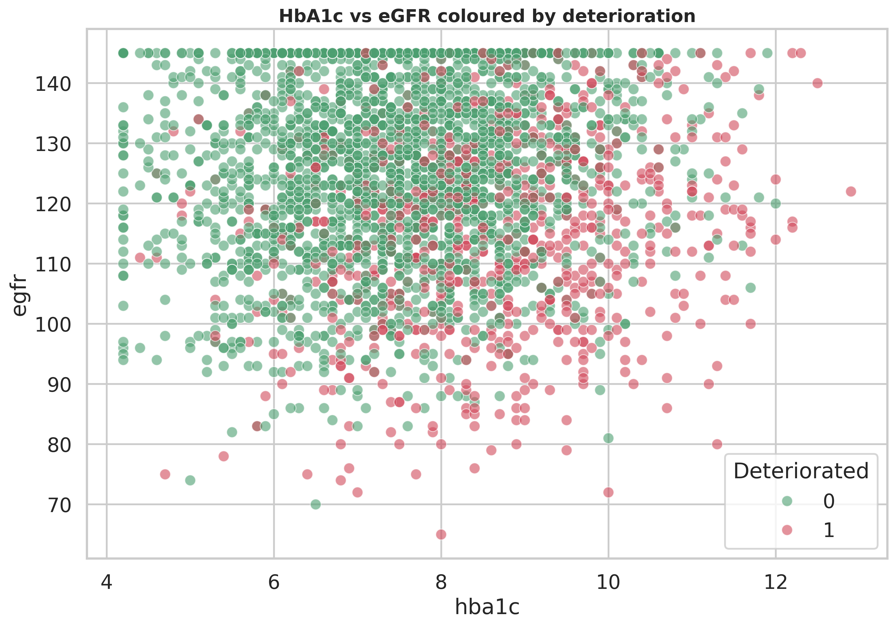
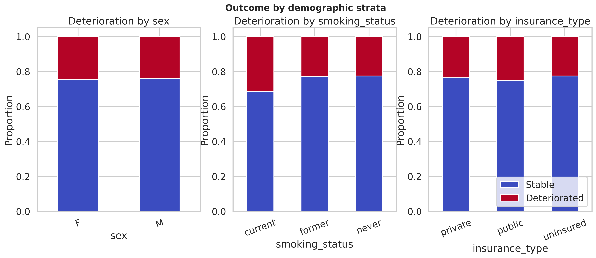
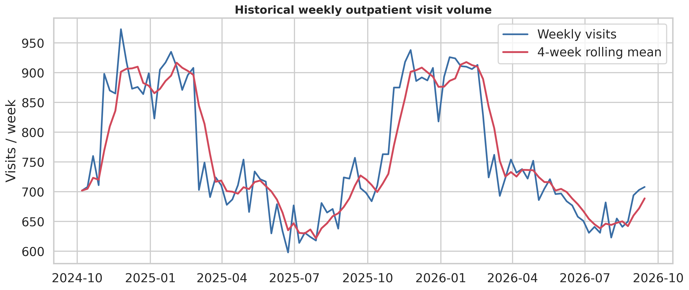
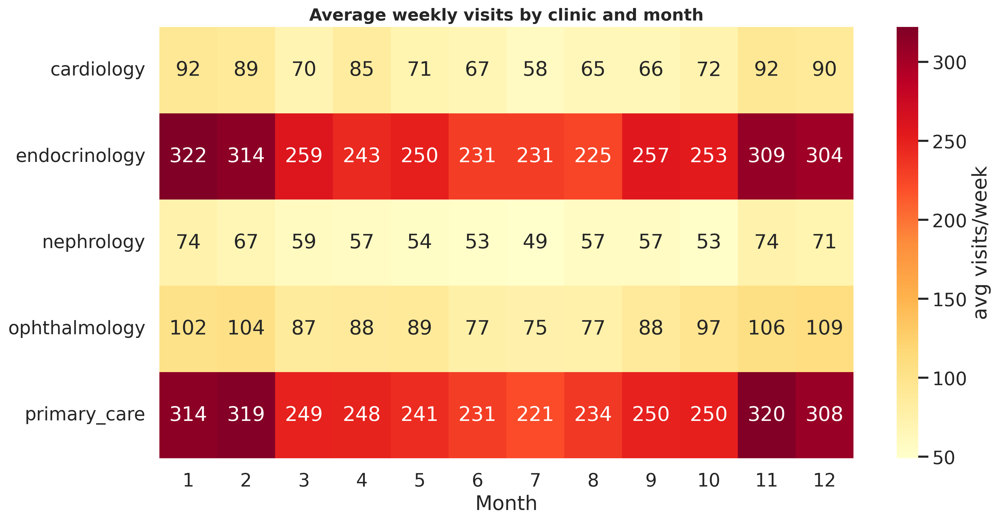
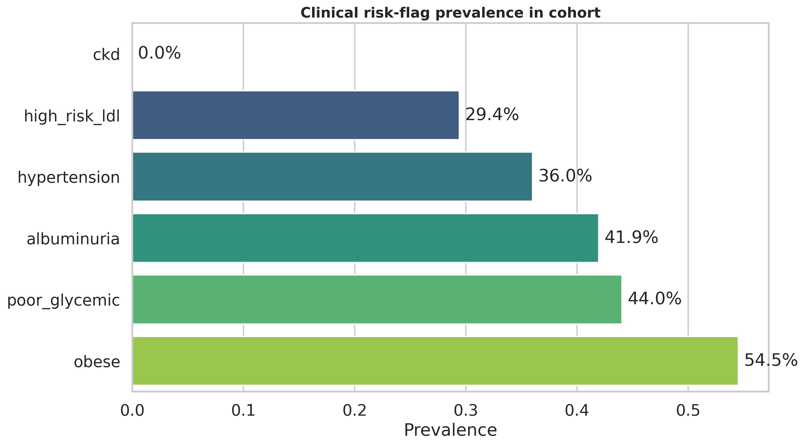

# Exploratory Data Analysis — Type 2 Diabetes Complications

_Generated 2026-09-20 14:28_

## 1. Executive summary

- Cohort size: **12,000 patients**
- Complication-free: **65.3%**; most common complication: **neuropathy** (11.7%)
- 12-month deterioration prevalence: **24.3%**
- Median HbA1c: **7.7%**, median eGFR: **124 mL/min/1.73m²**

## 2. Complication distribution

- none: 65.3%
- neuropathy: 11.7%
- cardiovascular: 9.7%
- retinopathy: 9.6%
- nephropathy: 3.6%

## 3. Strongest correlates of 12-month deterioration

| Feature | Point-biserial r | p-value | Significant |
|---|---:|---:|:--:|
| visit_count_12m | 0.466 | 0.00e+00 | ✅ |
| comorbidity_index | 0.350 | 0.00e+00 | ✅ |
| hba1c | 0.307 | 1.20e-260 | ✅ |
| age | 0.306 | 1.75e-258 | ✅ |
| egfr | -0.305 | 6.99e-256 | ✅ |
| flag_burden | 0.224 | 6.32e-136 | ✅ |
| creatinine | 0.161 | 2.07e-70 | ✅ |
| systolic_bp | 0.132 | 4.77e-48 | ✅ |

## 4. Statistical testing

- 35 of 48 feature/target associations were statistically significant (p < 0.05).
- Chi-square (categorical vs complication), ANOVA/Kruskal-Wallis (numeric across complications) and point-biserial correlations (numeric vs deterioration) were computed. See `outputs/reports/statistical_tests_summary.csv`.

## 5. Data quality

- No missing values in the feature store (100% completeness).

## 6. Figures

## 7. Modelling recommendations

- Use eGFR, HbA1c, urine ACR, comorbidity index and years-since-diagnosis as primary predictors of deterioration.
- Address mild class imbalance in the deterioration target with class weighting or SMOTE.
- The weekly demand series exhibits seasonality suitable for Prophet/SARIMA forecasting.
