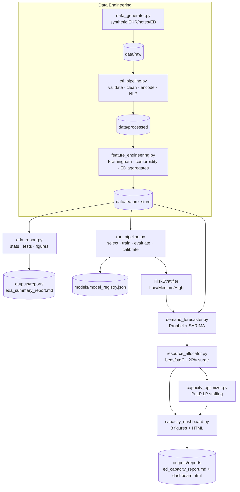

# Technical Architecture

**Project:** CVD Risk Stratification & ED Capacity Planning System
**Version:** 1.0.0

This document describes the system design, data flow, component interactions,
technology stack, scalability considerations, and future roadmap.

---

## 1. System Design Overview

The platform is a **modular, layered pipeline**. Each layer has a single
responsibility, communicates through well-defined file-based contracts (CSV /
Parquet / JSON), and can be executed independently or as part of an end-to-end
run via `main.py`.

| Layer | Package | Responsibility | Primary Outputs |
|-------|---------|----------------|-----------------|
| Data Engineering | `src/data_engineering` | Generate, validate, clean, and feature-engineer clinical data | `data/processed/*`, `data/feature_store/*` |
| EDA | `src/eda` | Statistical analysis & visualisation | `outputs/figures/*`, `outputs/reports/eda_summary_report.md` |
| Modeling | `src/modeling` | Risk classification (Low/Medium/High) | `models/*.pkl`, `models/model_registry.json` |
| ED Capacity | `src/ed_capacity` | Demand forecast, allocation, optimisation, dashboard | `outputs/reports/*`, `outputs/figures/ed_capacity_*` |

The design favours **reproducibility** (fixed seeds, pinned schemas, a config
file), **observability** (structured logging + timing to `logs/pipeline.log`),
and **loose coupling** (each stage reads the previous stage's persisted output
rather than in-memory handoff).

---

## 2. Data Flow Diagram

---

## 3. Component Interaction

### 3.1 Data Engineering
- `schema.py` defines Pydantic v2 contracts shared by every downstream module —
  the single source of truth for column names, types, and valid ranges.
- `etl_pipeline.py` orchestrates `DataIngestion` → `DataTransformer` →
  `DataQualityChecker`, emitting a `quality_report.json`.
- `feature_engineering.py` joins processed patients, ED aggregates, and NLP flags
  into the wide feature table and a daily ED demand time series.

### 3.2 Modeling
- `feature_selector.py` (mutual information + RFE + VIF) → `model_trainer.py`
  (grid-search CV pipeline) → `model_evaluator.py` (metrics/plots) →
  `model_registry.py` (versioned JSON registry) → `risk_stratifier.py`
  (calibrated inference interface).

### 3.3 ED Capacity
- `ed_pipeline.py` sequences `DemandForecaster` → `ResourceAllocator` →
  `CapacityOptimizer` → `CapacityDashboard`, then writes a Markdown report.
- `common.py` supplies shared paths, canonical risk ordering, resource-intensity
  maps, and demand-series loading (with a triage-level heuristic fallback).

---

## 4. Technology Stack

| Concern | Technology |
|---------|-----------|
| Language | Python 3.10+ |
| Data manipulation | pandas, NumPy |
| Storage formats | Parquet (pyarrow), CSV, JSON |
| Schema / validation | Pydantic v2 |
| Synthetic data | Faker |
| Machine learning | scikit-learn, XGBoost, imbalanced-learn |
| Statistics | SciPy, statsmodels |
| Forecasting | Prophet, SARIMA (statsmodels) |
| Optimisation | PuLP (CBC solver) |
| Visualisation | matplotlib, seaborn |
| Config | PyYAML (`config.yaml`) |
| Orchestration | `main.py` CLI + `Makefile` |
| Testing | pytest |
| Notebooks | Jupyter |

---

## 5. Scalability Considerations

- **Columnar storage** — the feature store is persisted as Parquet, enabling
  predicate/column pushdown and efficient reads for larger datasets.
- **Stateless stages** — each stage reads from disk and writes to disk, so stages
  can be distributed across workers or scheduled independently (e.g. Airflow /
  Prefect) without shared in-memory state.
- **Config-driven** — dataset size, CV folds, forecast horizon, and thresholds
  are externalised to `config.yaml` for tuning without code changes.
- **Model registry** — versioned metadata (`model_registry.json`) supports
  reproducible promotion of a "best model" and future A/B comparisons.
- **Vectorised transforms** — feature engineering uses pandas vectorised ops;
  per-row `apply` is limited to genuinely row-wise scoring logic.
- **Graceful degradation** — the forecaster falls back from Prophet to SARIMA,
  and the optimiser from PuLP to a closed-form heuristic, so the pipeline runs in
  constrained environments.

---

## 6. Future Enhancements

- Replace file handoffs with a warehouse/lakehouse (DuckDB, BigQuery, Snowflake)
  and register the feature store in a managed feature platform (Feast).
- Add workflow orchestration (Airflow/Prefect) with retries, SLAs, and lineage.
- Containerise (Docker) and add CI/CD (GitHub Actions) for automated tests and
  scheduled retraining.
- Serve `RiskStratifier` behind a FastAPI endpoint with request/response
  logging and model-monitoring (drift, calibration) alerts.
- Add real-time ED demand ingestion and rolling forecast refresh.
- Expand NLP from keyword flags to transformer-based clinical embeddings.
