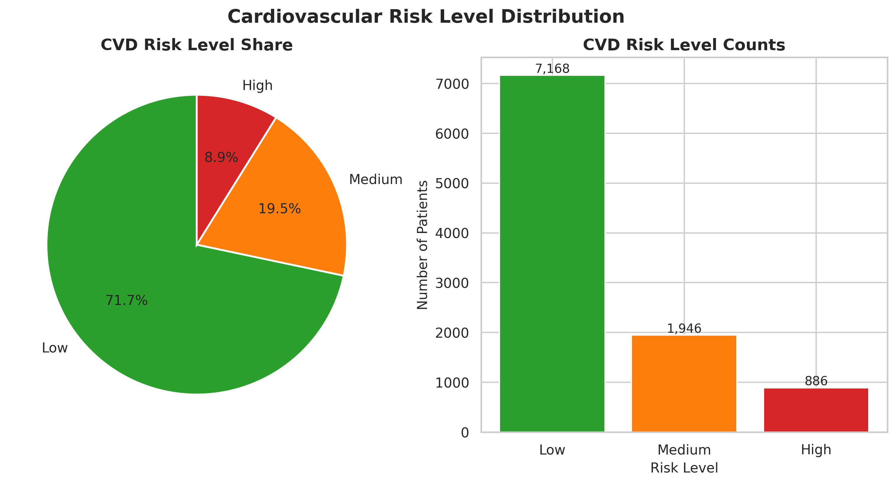
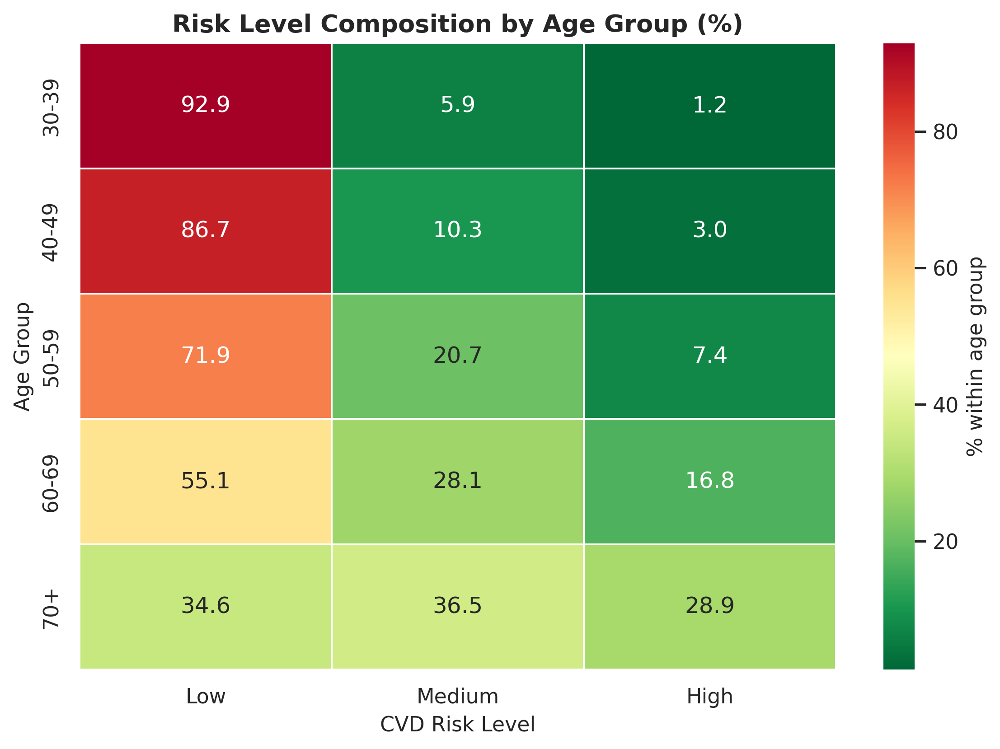
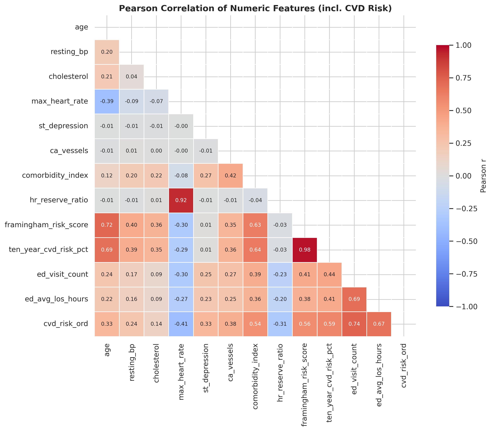
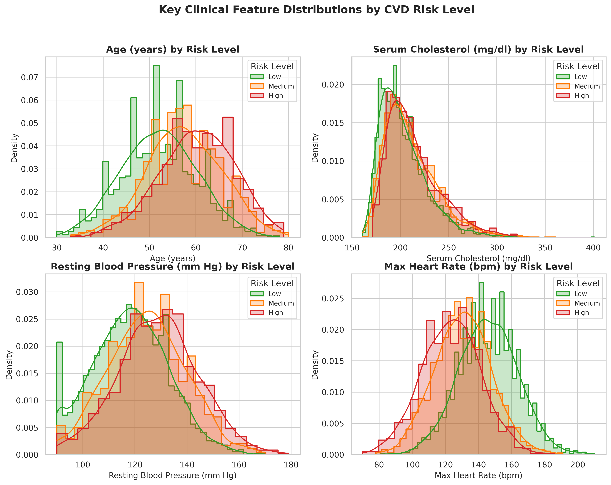
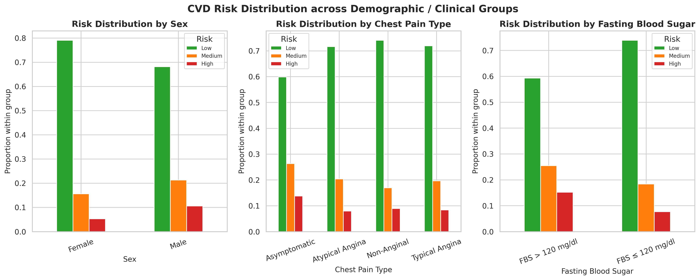
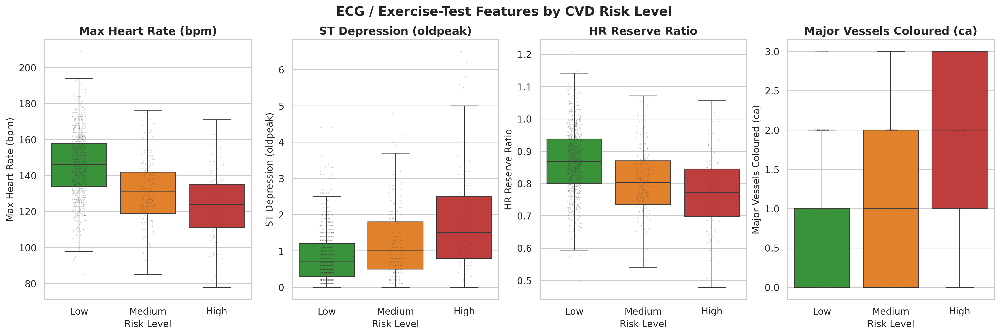
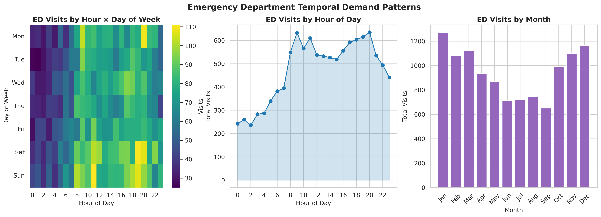
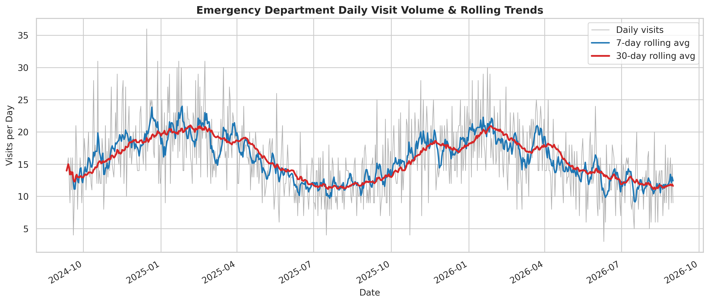
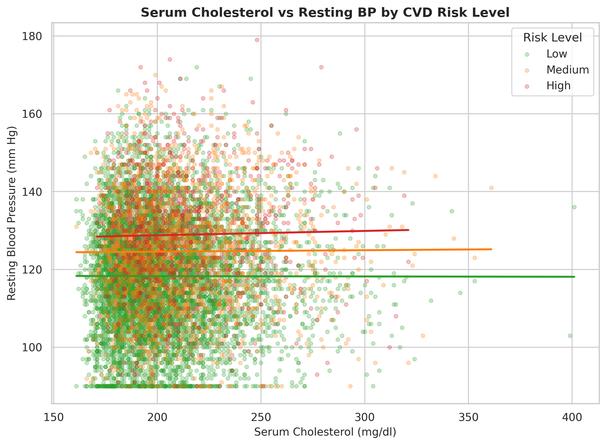
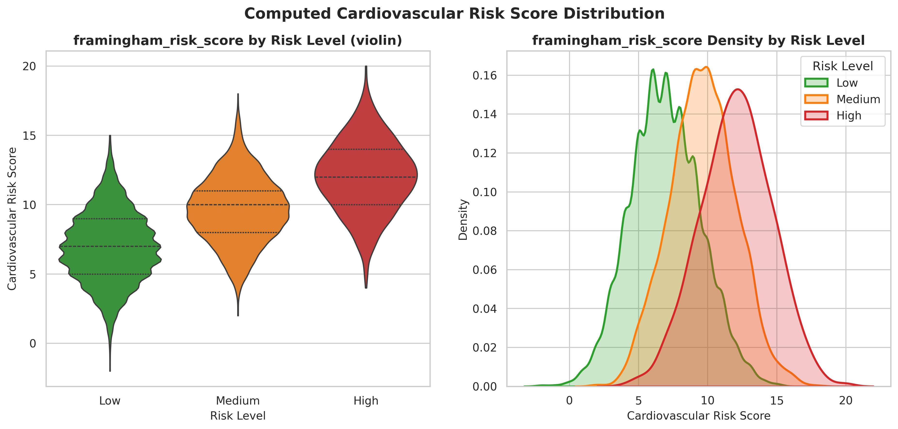

# Exploratory Data Analysis — Cardiovascular Risk Stratification

*Generated: 2026-09-20 04:58*

## 1. Executive Summary

This report analyses **10,000 synthetic patient records** with 53 engineered features spanning demographics, clinical measurements, ECG / exercise-test results, computed cardiovascular risk scores, and downstream Emergency Department (ED) utilisation. The prediction target is a three-level CVD **risk stratification** (Low / Medium / High).

Risk-level breakdown: **Low** = 7,168 (71.7%); **Medium** = 1,946 (19.5%); **High** = 886 (8.9%).

## 2. Data Characteristics

- Records: **10,000**
- Total columns: **53**
- Numeric features profiled: **12**
- Total missing cells: **0** (complete dataset)

### Numeric feature summary (selected)

| feature               |   mean |   std |    min |   median |    max |   skewness |
|:----------------------|-------:|------:|-------:|---------:|-------:|-----------:|
| age                   |  53.87 |  8.71 |  30    |    54    |  80    |       0.04 |
| resting_bp            | 120.46 | 15.05 |  90    |   120    | 179    |       0.15 |
| cholesterol           | 205.76 | 26.12 | 161    |   200    | 401    |       1.31 |
| max_heart_rate        | 140.95 | 19.55 |  70    |   141    | 210    |      -0.03 |
| st_depression         |   1.03 |  0.91 |   0    |     0.8  |   6.5  |       1.72 |
| ca_vessels            |   0.67 |  0.93 |   0    |     0    |   3    |       1.19 |
| comorbidity_index     |   1.65 |  1.13 |   0    |     2    |   6    |       0.49 |
| hr_reserve_ratio      |   0.85 |  0.11 |   0.46 |     0.85 |   1.31 |      -0    |
| framingham_risk_score |   7.91 |  2.99 |  -2    |     8    |  20    |       0.28 |
| ten_year_cvd_risk_pct |  20.73 | 10.81 |   2.56 |    19.15 |  76.85 |       1.16 |
| ed_visit_count        |   1.14 |  1.64 |   0    |     1    |  13    |       2.23 |
| ed_avg_los_hours      |   3.74 |  5.26 |   0    |     1.78 |  55.37 |       2.06 |

### CVD risk-level target distribution

| risk_level   |   count |   proportion |   disease_prevalence |
|:-------------|--------:|-------------:|---------------------:|
| Low          |    7168 |       0.7168 |               0.1314 |
| Medium       |    1946 |       0.1946 |               0.4435 |
| High         |     886 |       0.0886 |               0.7472 |

## 3. Key Findings

- Strongest linear correlates of the disease target: `ten_year_cvd_risk_pct` (r=+0.34), `ed_visit_count` (r=+0.33), `framingham_risk_score` (r=+0.33), `ed_avg_los_hours` (r=+0.32), `comorbidity_index` (r=+0.30).
- Categorical features significantly associated with risk level (chi-square): `ca_vessels` (V=0.28), `exercise_angina` (V=0.24), `age_group` (V=0.23), `bp_category` (V=0.16), `thal` (V=0.15).
- Numeric features differing most across risk groups (ANOVA effect size): `ed_visit_count` (η²=0.57), `ed_avg_los_hours` (η²=0.47), `ten_year_cvd_risk_pct` (η²=0.35), `framingham_risk_score` (η²=0.31), `comorbidity_index` (η²=0.29).
- Mean age rises with risk level: Low 52.1y, Medium 57.5y, High 60.2y.

## 4. Statistical Test Results

Significance codes: `***` p<0.001, `**` p<0.01, `*` p<0.05, `ns` not significant.

### 4.1 Chi-square — categorical vs risk level

| feature              |   statistic | p_value   |   effect_size | effect_metric   | significance   |
|:---------------------|------------:|:----------|--------------:|:----------------|:---------------|
| sex                  |    140.39   | <0.001    |        0.1176 | cramers_v       | ***            |
| chest_pain_type      |     65.6446 | <0.001    |        0.0546 | cramers_v       | ***            |
| fasting_blood_sugar  |    155.49   | <0.001    |        0.1239 | cramers_v       | ***            |
| rest_ecg             |     98.7163 | <0.001    |        0.0688 | cramers_v       | ***            |
| exercise_angina      |    584.136  | <0.001    |        0.2413 | cramers_v       | ***            |
| st_slope             |    129.401  | <0.001    |        0.0792 | cramers_v       | ***            |
| thal                 |    444.163  | <0.001    |        0.1484 | cramers_v       | ***            |
| ca_vessels           |   1539.03   | <0.001    |        0.2769 | cramers_v       | ***            |
| age_group            |   1055.25   | <0.001    |        0.2289 | cramers_v       | ***            |
| bp_category          |    541.9    | <0.001    |        0.1637 | cramers_v       | ***            |
| cholesterol_category |    168.135  | <0.001    |        0.0906 | cramers_v       | ***            |

### 4.2 ANOVA — numeric across risk groups

| feature               |   statistic | p_value   |   effect_size | effect_metric   | significance   |
|:----------------------|------------:|:----------|--------------:|:----------------|:---------------|
| age                   |     621.475 | <0.001    |        0.1106 | eta_squared     | ***            |
| resting_bp            |     306.67  | <0.001    |        0.0578 | eta_squared     | ***            |
| cholesterol           |     111.806 | <0.001    |        0.0219 | eta_squared     | ***            |
| max_heart_rate        |    1024.12  | <0.001    |        0.17   | eta_squared     | ***            |
| st_depression         |     626.002 | <0.001    |        0.1113 | eta_squared     | ***            |
| ca_vessels            |     862.752 | <0.001    |        0.1472 | eta_squared     | ***            |
| comorbidity_index     |    2068     | <0.001    |        0.2926 | eta_squared     | ***            |
| hr_reserve_ratio      |     549.972 | <0.001    |        0.0991 | eta_squared     | ***            |
| framingham_risk_score |    2259.27  | <0.001    |        0.3113 | eta_squared     | ***            |
| ten_year_cvd_risk_pct |    2691.4   | <0.001    |        0.35   | eta_squared     | ***            |
| ed_visit_count        |    6656.65  | <0.001    |        0.5711 | eta_squared     | ***            |
| ed_avg_los_hours      |    4352.86  | <0.001    |        0.4655 | eta_squared     | ***            |

### 4.3 Kruskal-Wallis — numeric across risk groups

| feature               |   statistic | p_value   |   effect_size | effect_metric   | significance   |
|:----------------------|------------:|:----------|--------------:|:----------------|:---------------|
| age                   |    1068.58  | <0.001    |           nan |                 | ***            |
| resting_bp            |     539.082 | <0.001    |           nan |                 | ***            |
| cholesterol           |     234.701 | <0.001    |           nan |                 | ***            |
| max_heart_rate        |    1660.65  | <0.001    |           nan |                 | ***            |
| st_depression         |     764.959 | <0.001    |           nan |                 | ***            |
| ca_vessels            |    1259.18  | <0.001    |           nan |                 | ***            |
| comorbidity_index     |    2576.39  | <0.001    |           nan |                 | ***            |
| hr_reserve_ratio      |     955.547 | <0.001    |           nan |                 | ***            |
| framingham_risk_score |    2812.49  | <0.001    |           nan |                 | ***            |
| ten_year_cvd_risk_pct |    2812.49  | <0.001    |           nan |                 | ***            |
| ed_visit_count        |    3993.48  | <0.001    |           nan |                 | ***            |
| ed_avg_los_hours      |    3750.51  | <0.001    |           nan |                 | ***            |

### 4.4 Point-biserial — feature vs disease target

| feature               |   statistic | p_value   |   effect_size | effect_metric   | significance   |
|:----------------------|------------:|:----------|--------------:|:----------------|:---------------|
| age                   |      0.2059 | <0.001    |        0.2059 | |r|             | ***            |
| resting_bp            |      0.151  | <0.001    |        0.151  | |r|             | ***            |
| cholesterol           |      0.1025 | <0.001    |        0.1025 | |r|             | ***            |
| max_heart_rate        |     -0.2537 | <0.001    |        0.2537 | |r|             | ***            |
| st_depression         |      0.1814 | <0.001    |        0.1814 | |r|             | ***            |
| ca_vessels            |      0.2293 | <0.001    |        0.2293 | |r|             | ***            |
| comorbidity_index     |      0.2967 | <0.001    |        0.2967 | |r|             | ***            |
| hr_reserve_ratio      |     -0.1918 | <0.001    |        0.1918 | |r|             | ***            |
| framingham_risk_score |      0.3255 | <0.001    |        0.3255 | |r|             | ***            |
| ten_year_cvd_risk_pct |      0.3355 | <0.001    |        0.3355 | |r|             | ***            |
| ed_visit_count        |      0.3274 | <0.001    |        0.3274 | |r|             | ***            |
| ed_avg_los_hours      |      0.3179 | <0.001    |        0.3179 | |r|             | ***            |

### 4.5 Shapiro-Wilk — normality of key features

| feature               |   statistic | p_value   |   effect_size | effect_metric   | significance   |
|:----------------------|------------:|:----------|--------------:|:----------------|:---------------|
| age                   |      0.9974 | <0.001    |           nan |                 | ***            |
| resting_bp            |      0.993  | <0.001    |           nan |                 | ***            |
| cholesterol           |      0.9148 | <0.001    |           nan |                 | ***            |
| max_heart_rate        |      0.9993 | 0.0367    |           nan |                 | *              |
| st_depression         |      0.8495 | <0.001    |           nan |                 | ***            |
| framingham_risk_score |      0.9856 | <0.001    |           nan |                 | ***            |

## 5. Visualisations

### CVD risk-level distribution (share and counts).

### Risk-level composition within each age group.

### Pearson correlation of numeric features.

### Key clinical feature distributions by risk.

### Risk distribution by sex, chest pain, FBS.

### ECG / exercise-test features by risk level.

### ED demand by hour, day of week and month.

### Daily ED volume with rolling averages.

### Cholesterol vs resting BP by risk level.

### Cardiovascular risk-score distribution.

## 6. Data Quality Findings

- No missing values detected across any column — the feature store is fully populated.

- Duplicate patient_id rows: **0**

## 7. Recommendations for Modeling

- Use the strongest correlates identified above as priority predictors, but retain the full feature set for tree-based models (XGBoost / Random Forest) that capture interactions.
- Several key numeric features are non-normal (Shapiro-Wilk); prefer tree-based models or apply scaling/transforms for linear models.
- Address the mild class imbalance in the risk target via stratified splits and class weights (or SMOTE) during training.
- Guard against leakage: `framingham_risk_score` / `ten_year_cvd_risk_pct` are derived from clinical inputs — decide explicitly whether they belong in the model feature set.
- Feed the risk-stratification output into the ED capacity-planning module, leveraging the temporal demand patterns surfaced here.
